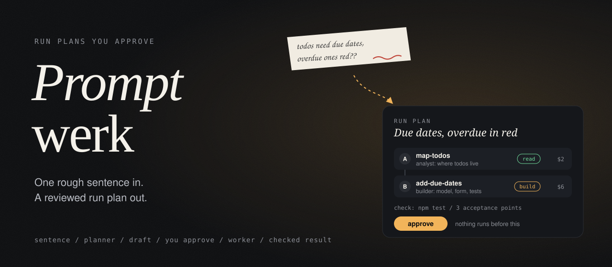
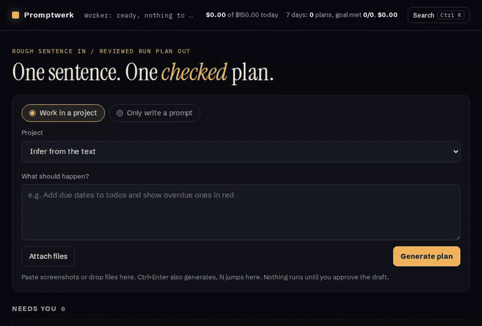
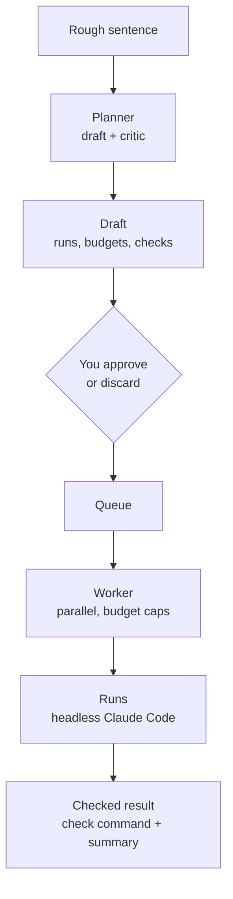
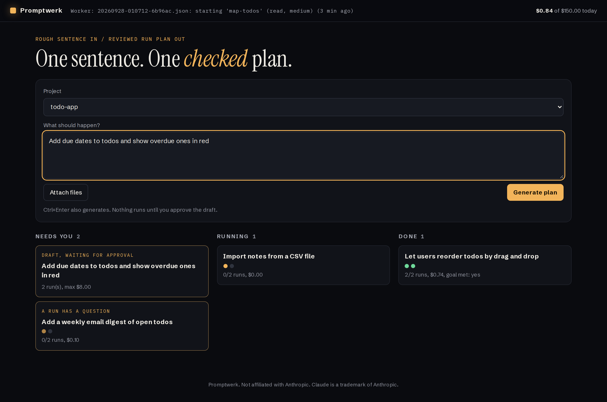
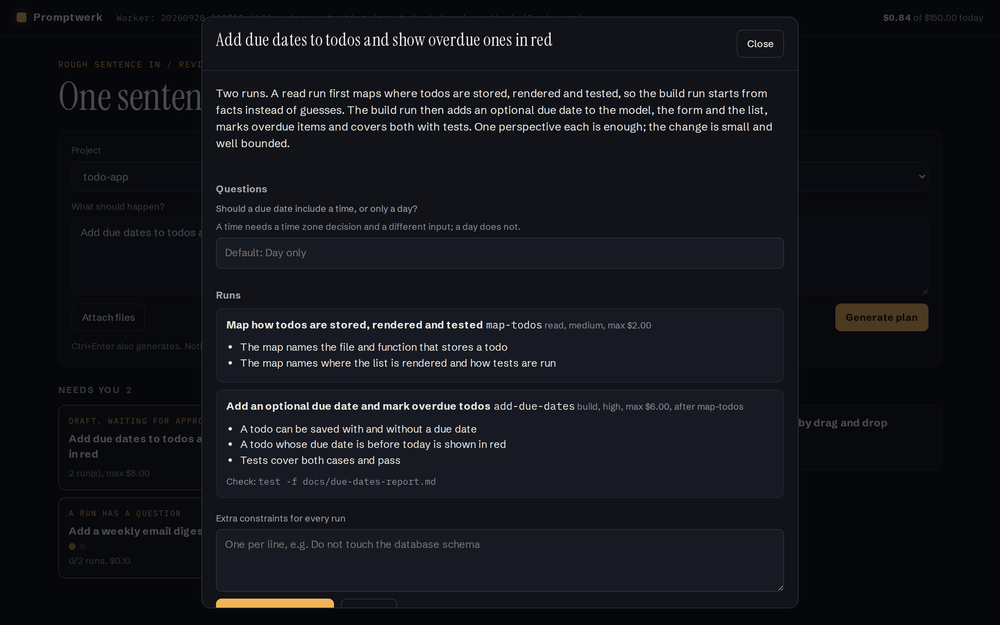
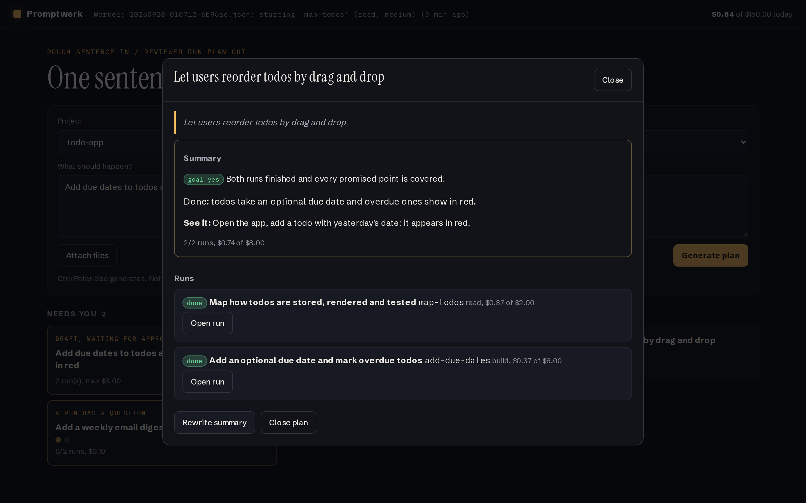
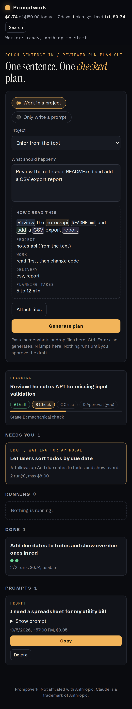

<p align="center">
  
</p>

<p align="center">
  <b>One rough sentence in. A reviewed run plan out.</b><br>
  A small, self-hosted control room for Claude Code: a planner turns your idea into a plan of
  headless runs, you approve it, a worker executes it inside guard rails and checks the result.
</p>

<p align="center">
  
</p>

<p align="center">
  <a href="#quick-start">Quick start</a> |
  <a href="#how-it-works">How it works</a> |
  <a href="#safety-model">Safety model</a> |
  <a href="#configuration">Configuration</a> |
  <a href="#faq">FAQ</a> |
  <a href="CHANGELOG.md">Changelog</a> |
  <a href="https://github.com/crizex/promptwerk/releases">Releases</a>
</p>

---

## The problem

Handing a coding agent a one-line idea works for small things. For anything bigger you end up
writing the same scaffolding every time: split the work, decide what may be touched, set a
budget, say what "done" means, then babysit the session and read a long transcript to find out
whether it actually worked.

Skipping that scaffolding is how you get a run that "quickly fixes something on the side",
burns through its budget, or reports success without a test ever running.

**Promptwerk writes the scaffolding for you, shows it to you, and only runs what you approved.**

## How it works



1. **You write one sentence** in the web UI, pick a project (or let the planner infer it from
   the text) and optionally attach files (pick, paste a screenshot or drop them on the form).
   While you type, a "How I read this" box highlights project, read and build words, delivery
   and file names. If you only need a prompt to paste into a chat, switch to **Only write a
   prompt**: one call, nothing runs, the result lands on a card with a copy button.
2. **The planner** (two Claude calls: a draft and a critic) turns it into a plan: one or more
   runs, each with a mode (`read` or `build`), effort, budget, artifacts, acceptance criteria,
   an optional shell check and dependencies on other runs. Open questions come back as
   clarifications, with the assumption the planner would make. The planner also sees facts
   about the project (git, stack, derived check command), its open points from earlier plans
   and, if configured, which kinds of runs the cheaper model handles well. The workshop card
   shows the stages: A draft, B check, C critic, D your approval.
3. **You review the draft.** Answer the questions (or tap one of the planner's suggestions), add
   constraints, read the full prompt and working directory of every run, see your attachments,
   the budget per run as a bar and the order of runs as a small graph.
   `check_plan.py` flags cycles, unknown projects and scope problems; fatal findings disable
   the approve button.
4. **The worker** picks up approved plans, starts runs whose dependencies are done, never two in
   the same directory, and stops starting new work at the daily cap or the usage limit.
5. **Each run** is a headless `claude -p` process with hooks: read runs may only write their
   artifacts, build runs cannot commit, push or do irreversible deletes. A run that needs a decision
   pauses and asks you in the UI. A run on the cheaper model that ends with a red check or
   missing artifacts is escalated once to the main model. A run that shows no progress for six
   hours is flagged.
6. **After a run** its check command runs. After the plan, a short summary states whether the
   goal was met, what to try, what is missing and a suggested follow-up, topped by a computed
   verdict: usable, usable with limits, or not finished, with the reasons. Open points go into a
   register that later plans of the same project see. **Follow up** starts a new task that knows
   the earlier plan; both link to each other. A finished read run with a findings list can be
   turned into an implementation draft with one button. Artifacts open right in the UI: Markdown
   rendered, JSON finding lists as a table sorted by severity, images inline.

Keyboard: `Ctrl K` (or `Cmd K`) opens a command palette to jump to any draft, plan or prompt,
`N` jumps to a new task, `Escape` closes one layer at a time.

## Screenshots

<p align="center">
  
</p>

| Reviewing a draft | Plan summary |
| --- | --- |
|  |  |

<p align="center">
  
</p>

The screenshots come from the demo mode below, with a fake Claude binary; no model was called.

## A plan

This is what the planner hands you for review (shortened from
[`examples/todo-plan.json`](examples/todo-plan.json)):

```json
{
  "topic": "Due dates for todos, with overdue items shown in red",
  "clarifications": [
    {
      "question": "Should a due date include a time, or only a day?",
      "options": ["Day only", "Day and time"],
      "assumption": "Day only",
      "blocking": false
    }
  ],
  "runs": [
    {
      "id": "map-todos",
      "mode": "read",
      "effort": "medium",
      "budget_usd": 2,
      "artifacts": ["docs/due-dates-map.md"],
      "acceptance": ["The map names the file and function that stores a todo"]
    },
    {
      "id": "add-due-dates",
      "mode": "build",
      "effort": "high",
      "budget_usd": 6,
      "needs": ["map-todos"],
      "artifacts": ["docs/due-dates-report.md"],
      "acceptance": ["A todo whose due date is before today is shown in red"],
      "check": "test -f docs/due-dates-report.md"
    }
  ]
}
```

The full schema is in [`prompts/plan.schema.json`](prompts/plan.schema.json), the planner
instructions in [`prompts/meta-prompt.md`](prompts/meta-prompt.md).

## Quick start

Requirements: Linux or macOS, Python 3.11 or newer (standard library only, no `pip install`),
and the [Claude Code](https://docs.claude.com/en/docs/claude-code) CLI, logged in.

```bash
git clone https://github.com/crizex/promptwerk.git
cd promptwerk
cp config.example.toml config.toml
# edit config.toml: add the absolute paths of your projects to `projects`

python3 web/server.py            # prints the URL and, on first start, the generated password
python3 bin/worker.py --loop     # in a second terminal
```

Open `http://127.0.0.1:8770`, log in as `promptwerk` with the printed password (it is also in
`<data_dir>/web-password`), type a sentence and press Generate.

For permanent use, adapt the two units in [`systemd/`](systemd/) (replace `YOUR_USER` and
`/path/to/promptwerk`).

### Try it without a model

The test suite ships a fake `claude` that returns the example plan and pretends to run it.
Useful to see the whole flow before you spend anything:

```bash
PROMPTWERK_CLAUDE_BIN=$PWD/tests/fake_claude.py \
PROMPTWERK_DATA_DIR=/tmp/promptwerk-demo \
python3 web/server.py
```

Run the worker with the same two variables. Put `FAKE_QUESTION` into the constraints of a draft
to see a run that asks you something, `FAKE_SLOW` for one that keeps running.

### Tests

```bash
python3 -m unittest discover tests
```

35 tests: plan checks, constraints, both hooks, the full flow planner to summary with the fake
binary, questions and budget raises, prompt mode, register, project facts, model choice and
escalation, the implementation draft, the verdict, and the web server (auth, headers,
validation, approval rules, attachments, withdraw and close rules, follow-ups, one run per
directory on answer and resume, path traversal).

## Safety model

Promptwerk runs an agent on your machine with your permissions. The guard rails are there to
stop the common accidents, not a determined attacker:

| Layer | What it does |
| --- | --- |
| **Local only** | The UI binds to `127.0.0.1`. Any other host prints a warning; put a TLS reverse proxy in front for remote access. |
| **Always a password** | Basic auth is never off. Without a configured password one is generated, stored with mode `600` and printed once. Configured passwords under 12 characters are refused. Failed logins are delayed. |
| **Request hardening** | Every POST needs the `X-Promptwerk: 1` header (blocks cross-site form posts). Strict CSP, `nosniff`, `no-referrer`, `no-store`, frame denial. File names are validated against path traversal; run output is served as plain text or download, never as HTML. |
| **Approval gate** | Nothing runs before you approve. Blocking clarifications must be answered first. |
| **Projects allowlist** | Every run directory must be in `projects`. An empty list means nothing can be approved. |
| **Read runs** | `write_guard.py` hook: writes only to the run's declared artifacts, `/tmp` and `/dev/null`; changing shell commands (delete, move, git, package installs, services) are blocked. |
| **Build runs** | `rights.py` hook: no `git add`/`commit`/`push`/hard resets, no dropped databases or Docker volumes, no stopped services or reboots, no writes to devices, no `rm -r` close to the filesystem root or on a whole project. The run writes these steps as tasks for you into its report. |
| **Budgets** | Per run, raised automatically only up to a multiple and a hard cap; a daily cap for the worker; a usage-window limit. |
| **Finish steps** | Auto commit, push and deploy scripts are off by default and opt-in in `config.toml`. |
| **Notifications** | Off by default. The optional webhook accepts `https` or loopback only. |

The hooks fail closed: if they cannot read a tool call, they block it.

## Configuration

Everything lives in `config.toml` (see [`config.example.toml`](config.example.toml)); every
key has a default except `projects`.

| Key | Default | Meaning |
| --- | --- | --- |
| `data_dir` | `~/.local/share/promptwerk` | Drafts, queue, runs, logs, attachments |
| `knowledge_dir` | `<repo>/knowledge` | Personas, conventions, house rules, project profiles |
| `projects` | `[]` | Directories runs may work in |
| `model` | `opus` | Model for planner, runs and summary (Claude Code alias or full model ID); a run may override it |
| `claude_bin` | `claude` | Claude Code CLI binary |
| `models.cheap` | empty | Optional cheaper model for simple runs, escalated once to `model` on failure |
| `budgets.planner_usd` | `8.0` | Cap per planner call |
| `budgets.summary_usd` | `1.5` | Cap for the plan summary |
| `budgets.run_cap_usd` | `25.0` | Hard cap per run, also after raises |
| `budgets.raise_factor` / `raise_multiple` | `1.5` / `3.0` | Automatic raise for a run that hits its cap |
| `budgets.daily_cap_usd` | `150.0` | No new runs once today cost this much |
| `worker.parallel` | `2` | Runs at the same time |
| `worker.usage_limit` | `0.90` | No new runs above this share of the usage window |
| `web.host` / `web.port` | `127.0.0.1` / `8770` | Where the UI listens |
| `web.user` / `web.password` | `promptwerk` / generated | Basic auth |
| `notify.webhook_url` | empty | Optional JSON POST per status change and when a draft is ready or planning failed |
| `finish.auto_commit` / `auto_push` / `deploy_dir` | off | What happens after a finished plan |

Environment overrides: `PROMPTWERK_CONFIG`, `PROMPTWERK_DATA_DIR`, `PROMPTWERK_CLAUDE_BIN`,
`PROMPTWERK_PASSWORD`, `PROMPTWERK_PORT`.

**Knowledge.** The planner reads `knowledge/personas.md` and `knowledge/conventions.md`, plus
your own `knowledge/house-rules.md` and `knowledge/tools.json` and an optional profile per
project in `knowledge/projects/`. Copy `house-rules.example.md` to start; `tools.json` is written
by `bin/tools.py refresh`. Your versions are gitignored. `knowledge/check-commands.json`
(`{"<project folder name>": "<command>"}`) overrides the derived check command of a project.

**Helper commands.**

| Command | What it does |
| --- | --- |
| `bin/tools.py refresh [--force]` | Writes `knowledge/tools.json` from what your `claude` CLI really has (tools, MCP tools, skills, plugins, agents); at most every 12 hours |
| `bin/register.py list` / `done <id>` | Open points collected from plan summaries |
| `bin/findings_draft.py <run id>` | Implementation draft from a finished read run's findings |
| `bin/prompt.py "<sentence>"` | One finished prompt, same as the prompt mode in the UI |

## Run statuses

| Status | Meaning |
| --- | --- |
| `running` | The Claude process is working |
| `checking` | The run finished, its check command is running |
| `waiting_for_answer` | The run asked a question; answer it in the UI to resume |
| `ratelimit` | Paused by a usage limit, resumes by itself |
| `budget_exhausted` | Hit its cap and its maximum raise; raise it by hand or discard |
| `check_failed` | Finished, but the check command failed |
| `incomplete` | Finished without all promised artifacts |
| `failed` | The process ended with an error |
| `done` | Finished, artifacts present, check passed |
| `discarded` | Cancelled by you |

## Project layout

```
bin/        planner, check_plan, worker, run, summary, hooks (rights, write_guard), config,
            prompt, register, project_facts, model_choice, tools, findings_draft
web/        stdlib HTTP server, one HTML page, vanilla JS, CSS, fonts
prompts/    planner meta prompt, plan JSON schema, brief for prompt mode
knowledge/  personas, conventions, examples for house rules and tools
examples/   an example plan
systemd/    unit files for the web UI and the worker
tests/      unittest suite and the fake claude binary
```

## FAQ

**Does it need an API key?** No. It calls the `claude` CLI, so it uses however you are logged in
there. Budgets are passed as `--max-budget-usd`.

**Can I use another model?** Set `model` in `config.toml`. A single run in a plan may also name
its own model.

**Is it safe to expose on the internet?** Not by itself. Keep it on `127.0.0.1` and reach it
through SSH port forwarding or a TLS reverse proxy with its own authentication.

**Why no database, no framework, no npm?** The whole state is JSON files in `data_dir`. You can
read, back up and repair it with `cat`. Fewer moving parts to break at night.

**Can a run still do damage?** A build run can change anything in its project directory, that
is its job. Use version control, keep `auto_push` off, and review the diff. The hooks catch the
usual accidents, not every possible shell command.

**Why does the planner ask questions instead of just deciding?** Because a wrong assumption costs
a whole run. Non-blocking questions come with the assumption the planner will make if you do not
answer.

## Changelog

See [CHANGELOG.md](CHANGELOG.md) and the
[releases page](https://github.com/crizex/promptwerk/releases).

## License

[MIT](LICENSE). Fonts in `web/fonts/` are under the SIL Open Font License, see
[`web/fonts/FONTS.md`](web/fonts/FONTS.md).

Not affiliated with Anthropic. Claude is a trademark of Anthropic.
